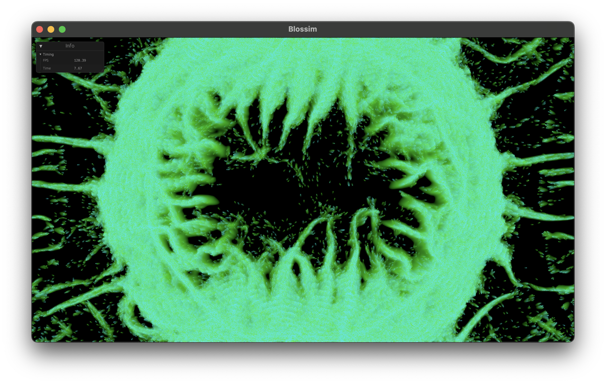

# Blossim

A language and simulator for generating abstract emergent artworks, built with [wgpu](https://wgpu.rs) and [wgsl](https://www.w3.org/TR/WGSL/). 



## Usage

```bash
cargo run --release
```
